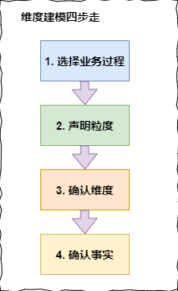

此面试题来自牛客网友分享的美团优选一面，面试时长一小时。网友情况：海外水本，在某三线中厂工作2年。

参考答案由本公众号提供。如有错误，欢迎指正！

以下为面试过程中提问，岗位为大数据开发，根据提问内容看出，主要偏数仓方向

自我介绍

到北京工作的意愿

SQL题，给一张城市和交易额表，一张城市对应省份表， 取出 省份 总 交易额大于 500 的 省份 的名字

SQL题，基于刚才， 得出 省份 总 交易额 [0,500 ] , [500,1000 ] , [1000,+∞ ] 在以下三个区间的 省份 的 数量

SQL题，还是基于刚才， 按从小到大的顺序得出每个城市的累计交易额，可以用窗口

根据分隔符划分字段，可以用正则表达

主要负责的产品

产品的指标如何知道带来多少价值

指标如何做到精准

就项目中提到的某个实体，讲一下他对应的属性有哪些

如果你建模的话，你会如何建模

主要都抽取哪些数据源，使用什么工具

描述一下抽取的内部逻辑，怎么实现的

除了工作，有去读什么书学习吗

你觉得flink和spark streaming有什么区别

spark streaming相比flink有什么优点

有什么想问的吗

答案详细解析

1. 自我介绍

面试的时候，面试官说的第一句话就是：“介绍一下你自己吧。”

很多人真的很实诚的就只说一句：“我叫xx，来自xx，今年xx岁。”然后双方冷场。

这样的自我介绍还不如前段时间流行的一句话：“我叫xx,我喜欢唱跳、rap、篮球。”起码你还让面试官知道了你的特长。

所以这里就需要你用最短的时间让面试官记住你，突出自己的优势、有论证力的说服对方。

原则如下：不要大段背诵简历内容；不要说流水账，内容冗长；自我介绍时间尽量控制在一分钟左右。

那么怎么在最短时间内满足以上三条。

罗振宇说过：“笨拙的人讲道理，而聪明的人会说故事。”

所以面试时我们要摆脱常规回答，学会“讲故事”。那故事怎么讲，记住以下八个字，将自己的经历或想法套进去：

目标：就是我想要做什么，我想要成为什么样的人；

阻碍：做这件事的难点是什么，有哪些“质疑”点；

努力：为了克服难点和“质疑”，我做了哪些事情；

结果：通过我的努力，我现在获得了什么样的成就。

有时间了针对 自我介绍 我再详细的讲解下，这部分还是很重要的，因为这部分就是“推销”自己，给自己打广告的时间。

2. 到北京工作的意愿

招人肯定是希望找到一个踏实，稳定的人，而不是那种来了几天或一段时间就走的人。面试官问你这个问题，一是在看你大概能在公司呆多久，二是看公司是否有必要培养你或者录用你。

所以回答时一定要表达出你一定能来北京并且能长时间待下去（即使你不是这样），具体回答发挥个人想象。

3. SQL题，给一张城市和交易额表，一张城市对应省份表， 取出 省份 总 交易额大于 500 的 省份 的名字

为了便于理解，根据上面的问题，我们先构造这两张表：

城市交易额表 business_table

city_num：城市编号
gmv：交易额

city_num	gmv
1001	210
1001	90
1002	250
1003	200
1004	700
1005	350
1005	150
1006	250
1007	150
城市对应省份表：province_table

province_num：省份编号
province_name：省份名称
city_num：城市编号

province_num	province_name	city_num
11	a	1001
11	a	1005
12	b	1002
12	b	1003
13	c	1004
13	c	1006
13	c	1007
根据以上表，sql 语句如下（以下仅为其中一种写法，仅供参考）

SELECT MAX(tmp.province_name)
FROM (
SELECT bt.city_num, bt.gmv, pt.province_num, pt.province_name
FROM business_table bt
LEFT JOIN province_table pt ON bt.city_num = pt.city_num
) tmp
GROUP BY tmp.province_num
HAVING SUM(tmp.gmv) > 500;
4. SQL题，基于刚才， 得出 省份 总 交易额 [0,500 ] , [500,1000 ] ,  [1000,+oo ] 在以下三个区间的 省份 的 数量

参考 sql 语句如下：

SELECT
COUNT(CASE
WHEN tmp2.pro_gmv >= 0
AND tmp2.pro_gmv < 500 THEN tmp2.pro_name
ELSE NULL END) AS gmv_0_500,
COUNT(CASE
WHEN tmp2.pro_gmv >= 500
AND tmp2.pro_gmv < 1000 THEN tmp2.pro_name
ELSE NULL END) AS gmv_500_1000,
COUNT(CASE
WHEN tmp2.pro_gmv >= 1000 THEN tmp2.pro_name
ELSE NULL END) AS gmv_1000_
FROM (
SELECT MAX(tmp.province_name) AS pro_name, SUM(tmp.gmv) AS pro_gmv
FROM (
SELECT bt.city_num, bt.gmv, pt.province_num, pt.province_name
FROM business_table bt
LEFT JOIN province_table pt ON bt.city_num = pt.city_num
) tmp
GROUP BY tmp.province_num
) tmp2;
5. SQL题，还是基于刚才， 按从小到大的顺序得出每个城市的累计交易额，可以用窗口

参考 sql 语句如下：

# 既然面试官让用窗口函数，那咱们就别客气了
SELECT city_num, gmv
FROM (
SELECT DISTINCT city_num, SUM(gmv) OVER(PARTITION BY city_num) AS gmv
FROM business_table
) tmp
ORDER BY gmv;
6. 根据分隔符划分字段，可以用正则表达

# java
String address="上海|上海市|闵行区|吴中路";
String[] splitAddress=address.split("\\|"); //如果以竖线为分隔符，则split的时候需要加上两个斜杠 \\ 进行转义

#sql
hive> select split('abcdef', 'c') from test;
["ab", "def"]
7. 主要负责的产品

这个根据简历或者你自己的情况实际实说就行。

8. 产品的指标如何知道带来多少价值

这题没有标准答案，根据自己的理解回答即可。

以下仅供参考：

在《精益数据分析》一书中给出了两套比较常用的指标体系建设方法论，其中一个就是比较有名的海盗指标法，也就是我们经常听到的AARRR海盗模型。海盗模型是用户分析的经典模型，它反映了增长是系统性地贯穿于用户生命周期各个阶段的：用户拉新(Acquisition)、用户激活(Activation)、用户留存(Retention)、商业变现(Revenue)、用户推荐(Referral)。

为什么要说这个模型呢，因为通过这个模型中的一些关键指标我们可以反推出产品的指标所带来的价值有哪些。

AARRR模型：

A 拉新: 通过各种推广渠道，以各种方式获取目标用户，并对各种营销渠道的效果评估，不断优化投入策略，降低获客成本。涉及关键指标例如 新增注册用户数、激活率、注册转化率、新客留存率、下载量、安装量等，我们通过这些指标就可反应出获取目标用户的效果是怎样的。

A 活跃：活跃用户指真正开始使用了产品提供的价值，我们需要掌握用户的行为数据，监控产品健康程度。这个模块主要反映用户进入产品的行为表现，是产品体验的核心所在。涉及关键指标例如 DAU/MAU 、日均使用时长、启动APP时长、启动APP次数等。通过这些指标可以反映出用户的活跃情况。

R 留存：衡量用户粘性和质量的指标。涉及关键指标例如 留存率、流失率等。通过这些指标可以反映出用户的留存情况。

R 变现: 主要用来衡量产品商业价值。涉及关键指标例如 生命周期价值(LTV)、客单价、GMV等。这些指标可以反映出产品的商业价值。

R 推荐：衡量用户自传播程度和口碑情况。涉及关键指标例如 邀请率、裂变系数等。

9. 指标如何做到精准

同上题，没有标准答案。

仅供参考：

指标要做到精准，就必须使用科学方法选指标。

选指标常用方法是指标分级方法和OSM模型。

1. 指标分级方法：指标分级主要是指标内容纵向的思考，根据企业战略目标、组织及业务过程进行自上而下的指标分级，对指标进行层层剖析，主要分为三级T1、T2、T3。

T1指标：公司战略层面指标 用于衡量公司整体目标达成情况的指标，主要是决策类指标，T1指标使用通常服务于公司战略决策层。

T2指标：业务策略层面指标 为达成T1指标的目标，公司会对目标拆解到业务线或事业群，并有针对性做出一系列运营策略，T2指标通常反映的是策略结果属于支持性指标同时也是业务线或事业群的核心指标。T2指标是T1指标的纵向的路径拆解，便于T1指标的问题定位，T2指标使用通常服务业务线或事业群。

T3指标：业务执行层面指标 T3指标是对T2指标的拆解，用于定位T2指标的问题。T3指标通常也是业务过程中最多的指标。根据各职能部门目标的不同，其关注的指标也各有差异。T3指标的使用通常可以指导一线运营或分析人员开展工作，内容偏过程性指标，可以快速引导一线人员做出相应的动作。

2. OSM模型（Obejective，Strategy，Measurement）：是指标体系建设过程中辅助确定核心的重要方法，包含业务目标、业务策略、业务度量，是指标内容横向的思考。

O：用户使用产品的目标是什么？产品满足了用户的什么需求？主要从用户视角和业务视角确定目标，原则是切实可行、易理解、可干预、正向有益。

S：为了达成上述目标我采取的策略是什么？

M：这些策略随之带来的数据指标变化有哪些？

10. 就项目中提到的某个实体，讲一下他对应的属性有哪些

实际项目问题，根据简历中写的叙述。

这里也给我们提个醒：简历中所写的项目我们必须非常熟悉才行，并且我们需要熟悉所写项目的整个生命周期，包括项目开发 前中后 期的所有内容，说的时候可以比简历上写的更详细，但是千万不能和简历上有出入。

11. 如果你建模的话，你会如何建模

具体的建模可看这篇文章：数仓建设中最常用模型--Kimball维度建模详解

以下内容截取自上述文章

提到建模，就牢记维度建模四步走，模型怎么建，就围绕以下四步叙说：

维度建模四步走
1、选择业务过程
维度建模是紧贴业务的，所以必须以业务为根基进行建模，那么选择业务过程，顾名思义就是在整个业务流程中选取我们需要建模的业务，根据运营提供的需求及日后的易扩展性等进行选择业务。

2、声明粒度
从关注原子粒度开始设计，也就是从最细粒度开始，因为原子粒度能够承受无法预期的用户查询。但是上卷汇总粒度对查询性能的提升很重要的，所以对于有明确需求的数据，我们建立针对需求的上卷汇总粒度，对需求不明朗的数据我们建立原子粒度。

3、确认维度
维度表是作为业务分析的入口和描述性标识，所以也被称为数据仓库的“灵魂”。声明完粒度之后，就要确定哪些属性是维度，那么怎么确定哪些属于维度属性呢，这里就不详细展开了，可以点击上面的文章链接，有详细说明。

4、确认事实
维度建模的核心原则之一是同一事实表中的所有度量必须具有相同的粒度。这样能确保不会出现重复计算度量的问题。有时候往往不能确定该列数据是事实属性还是维度属性。记住最实用的事实就是数值类型和可加类事实。

这块内容太多了，说完以上四步之后可以在具体的聊下数仓是怎么分层的，每层都存放什么数据等。具体文章可点击：结合公司业务分析离线数仓建设

12. 主要都抽取哪些数据源，使用什么工具

根据简历的项目回答。

以下仅供参考，主要抽取的数据：

业务库数据，使用sqoop进行抽取

流量日志数据，使用flume实时采集

第三方公司数据，使用通用接口采集

13. 描述一下抽取的内部逻辑，怎么实现的

根据简历的项目回答。

以下仅供参考：

在开始创建抽取系统之前，需要一份逻辑数据映射，它描述了那些提交到前台的表中原始字段和最终目标字段之间的关系。该文档贯穿ETL系统。

设计逻辑：

有一个规划

确定候选的数据源

使用数据评估分析工具分析源系统

接受数据线和业务规则的遍历

充分理解数据仓库数据模型

验证计算和公式的有效性

逻辑数据映射的组成：目标表名称、表类型、SCD(缓慢变化维度)、源数据库、源表名称、源列名称、转换。

这个表必须清晰的描述在转换的过程中包含的流程，不能有任何疑问的地方。

表类型给了我们数据加载过程执行的次序：先是维表，然后是事实表。与表类型一起，加载维表过程SCD类型很重要，开发之前需要理解哪些列需要保留历史信息以及如何获取历史信息所需的策略。

在源系统得到确认和分析之前，完整的逻辑数据映射是不存在的，源系统分析通常分为两个主要阶段：数据发现阶段，异常检测阶段。

数据发现阶段：需要ETL小组深入到数据的需求中，确定每一个需要加载到数据仓库中的源系统，表和属性，为每一个元素确定适当的源或者记录系统是一个挑战，必须仔细评估。

异常检测阶段：检查源数据库中每一个外键是否有NULL值。如果存在NULL值，必须对表进行外关联。如果NULL不是外键而是一个列，那么必须有一个处理NULL数据的业务规则。只要允许，数据仓库加载数据一定用默认值代替NULL。

14. 除了工作，有去读什么书学习吗

仅供参考：

前段时间读了《数仓工具箱-维度建模权威指南》这本书，受益颇多，对维度建模有了一个清晰的认知，维度建模就是时刻考虑如何能够提供简单性，以业务为驱动，以用户理解性和查询性能为目标的这样一种建模方法。

目前正在读《大数据日知录：架构与算法》，这本书涉及到的知识非常多，全面梳理了大数据存储与处理的相关技术，看书能让我更加系统化，体系化的学习大数据的技术。

注：以上两本书的电子版，可在五分钟学大数据公众号后台获取，回复关键字：数仓工具箱 或 大数据日知录

15. 你觉得flink和spark streaming有什么区别

这个问题是一个非常宏观的问题，因为两个框架的不同点非常之多。但是在面试时有非常重要的一点一定要回答出来：Flink 是标准的实时处理引擎，基于事件驱动。而 Spark Streaming 是微批（ Micro-Batch ）的模型。

下面就分几个方面介绍两个框架的主要区别：

架构模型：

Spark Streaming 在运行时的主要角色包括：Master、Worker、Driver、Executor；

Flink 在运行时主要包:Jobmanager、Taskmanager 和 Slot。

任务调度：

Spark Streaming 连续不断的生成微小的数据批次，构建有向无环图 DAG， Spark Streaming 会依次创DStreamGraph、JobGenerator、JobScheduler；

Flink 根据用户提交的代码生成 StreamGraph，经过优化生成 JobGraph，然后提交给JobManager 进行处理， JobManager 会根据 JobGraph 生成 ExecutionGraph，ExecutionGraph 是 Flink 调度最核心的数据结构，JobManager 根据 ExecutionGraph 对 Job 进行调度。

时间机制：

Spark Streaming 支持的时间机制有限，只支持处理时间。

Flink 支持了流处理程序在时间上的三个定义：处理时间、事件时间、注入时间。同时也支持 watermark 机制来处理滞后数据。

容错机制：

对于 Spark Streaming 任务，我们可以设置 checkpoint，然后假如发生故障并重启，我们可以从上次 checkpoint 之处恢复，但是这个行为只能使得数据不丢失，可能 会重复处理，不能做到恰好一次处理语义。

Flink 则使用两阶段提交协议来解决这个问题。

Flink的两阶段提交协议具体可以看这篇文章：八张图搞懂 Flink 端到端精准一次处理语义 Exactly-once

16. Spark Streaming相比Flink有什么优点

一般都是问 Flink 比 Spark 有什么优势，这个是反过来问的，要注意哦

微批处理优势：

Spark Streaming 的微批处理虽然实时性不如Flink，但是微批对于实时性要求不是很高的任务有着很大优势。

比如10W+的数据写入MySql，假如采用Flink实时处理，Sink 到 MySql 中，Flink是事件驱动的，每条都去插入或更新数据库，明显不靠谱，因为数据库扛不住。假如在Flink的Sink处加上批处理，虽然可以提高性能，但是如果最后一个批次没有达到批大小阈值，数据就不会刷出进而导致数据丢失。

Flink是基于状态的计算，所以在多个窗口内做关联操作是很难实现的，只能把所有状态丢到内存中，但如果超出内存，就会直接内存溢出。Spark 因为是基于RDD的可以利用RDD的优势，哪怕数据超出内存一样算，所以在较粗时间粒度极限吞吐量上Spark Streaming要优于Flink。

语言优势：

Flink和Spark都是由Scla和Java混合编程实现，Spark的核心逻辑由Scala完成，而Flink的主要核心逻辑由Java完成。在对第三方语言的支持上，Spark支持的更为广泛，Spark几乎完美的支持Scala，Java，Python，R语言编程。

17. 有什么想问的吗

面试是双方相互了解的过程，所以出于礼貌在面试结束询问一下你有没有什么想问的。当然面试官也想借此了解你对他们公司的了解程度及感兴趣程度。

所以请不要回答“我没有问题了”，而是要把这个问题当作最后一次发言机会。问的问题要围绕着这家公司本身，要让对方觉得你很关心、关注公司。

以下是可以问的：

公司对这个岗位的期望是什么样的？其中，哪些部分是我需要特别努力的？

是否有资深的人员能够带领新进者，并让新进者有发挥的机会？

公司强调团队合作。那在这个工作团队中，哪些个人特质是公司所希望的？

能否为我介绍一下工作环境？

以下是不该问的：

薪资待遇

过于高深的问题

超出应聘岗位的问题

https://blog.csdn.net/a934079371/article/details/114769686
